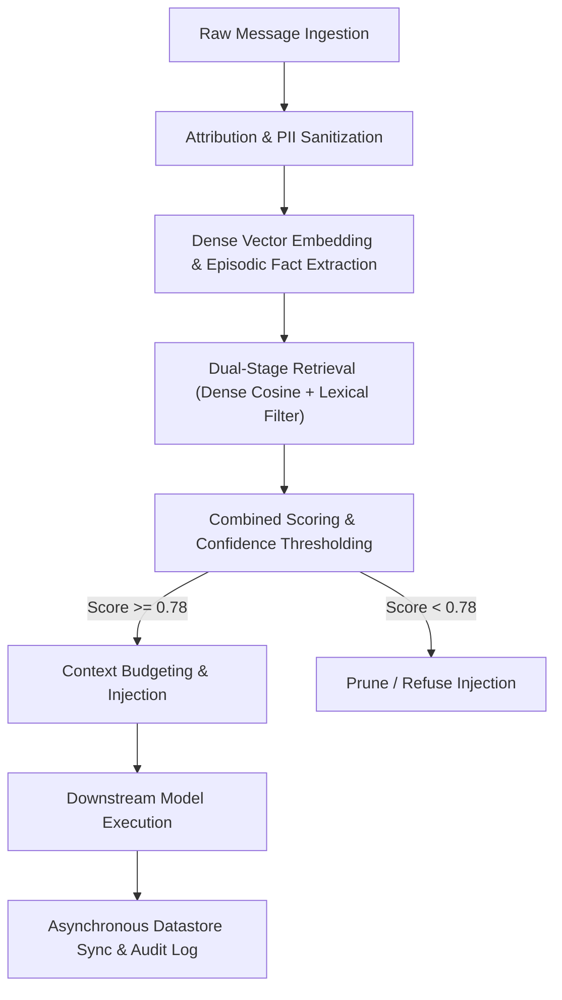

# Explainability Architecture — Memori Agent

This document outlines the cognitive reasoning framework, retrieval scoring mechanics, data lineage protocols, operational boundaries, and compliance adherence for **Memori Agent** (`memori-agent`, v1.0.0), compliant with OpenGAP Spec 0.1.0 and GitAgent Passport clearance standards.

---

## How the Agent Decides

The Memori Agent operates through a deterministic 5-stage memory orchestration and context injection pipeline designed to retrieve factual, temporally relevant context while preventing hallucination and context window exhaustion.

### 1. Ingestion and Boundary Validation
Upon intercepting dialogue or tool execution events via SDK hooks, the agent verifies tenant credentials and attribution metadata:
- **Entity Identification (`entity_id`):** Identifies the active user, workspace, or persistent identity.
- **Process Identification (`process_id`):** Identifies the calling agent, routine, or client application.
If attribution attributes are absent or invalid, the ingestion pipeline halts to enforce tenant isolation.

### 2. Episodic Fact Extraction and Representation
Dialogue chunks are processed to identify stable assertions, preferences, interaction constraints, and task outcomes:
- Redundant greetings, stop words, and filler conversational tokens are stripped.
- In-line PII detection masks social security identifiers, credit card PANs, and sensitive access tokens.
- Refined facts are transformed into dense mathematical embeddings \(\mathbf{e}_m \in \mathbb{R}^d\).

### 3. Dual-Stage Retrieval & Temporal Decay Scoring
When synthesizing context for a new user query \(q\), the agent computes candidate relevance using a composite objective balancing semantic proximity and temporal recency:

$$S(q, m) = \alpha \cdot \cos(\mathbf{e}_q, \mathbf{e}_m) + (1 - \alpha) \cdot \exp(-\lambda \cdot \Delta t)$$

Where:
- \(\cos(\mathbf{e}_q, \mathbf{e}_m) = \frac{\mathbf{e}_q \cdot \mathbf{e}_m}{\|\mathbf{e}_q\| \|\mathbf{e}_m\|}\) represents the cosine angle between query and memory vectors.
- \(\alpha \in [0, 1]\) is the semantic weight parameter (default: \(0.85\)).
- \(\lambda \ge 0\) is the exponential temporal decay rate factor (default: \(0.005 \, \text{day}^{-1}\)).
- \(\Delta t = t_{\text{current}} - t_{\text{memory}}\) is the elapsed time in days since memory creation.

### 4. Admission Thresholds and Boundary Refusals
- **Admission Threshold:** Candidate memory items are admitted into prompt synthesis if and only if \(S(q, m) \ge \tau\) where the baseline acceptance threshold \(\tau = 0.78\).
- **Contradiction Resolution:** If an incoming memory item asserts a state contrary to an existing memory with timestamp \(t_{\text{new}} > t_{\text{prior}}\), the prior record is flagged as superseded and omitted from active injection.
- **Graceful Fallback:** If retrieval queries fail or candidate memories fall below \(\tau\), the agent falls back to passing unaugmented system prompts without blocking the host conversation.

### 5. Human-in-the-Loop & Override Protocols
- Administrative users can inspect, modify, or delete any entity memory store via the Memori CLI or Web Console.
- A programmatic kill-switch halts all memory read/write cycles instantly, allowing unaugmented LLM fallback during system maintenance or security anomalies.

---

## The Data It Uses

The Memori Agent processes operational, conversational, and episodic memory data with strict tenant partitioning and governance controls:

### 1. Ingested Dialogue Streams & Tool Outcomes
- **Conversational Turns:** User inputs, assistant outputs, system prompts, and tool return values captured through registered SDK middlewares.
- **Attribution Metadata:** Canonical identifiers (`entity_id`, `process_id`, `session_id`) and ISO-8601 UTC creation timestamps.
- **Categorical Tags:** Memory classification tags (e.g., `preference`, `fact`, `constraint`, `rule`, `relationship`).

### 2. High-Dimensional Vector Embeddings
- Dense mathematical vectors generated by enterprise embedding models (dimension size: 768 to 1536).
- Vector representations are stored within isolated index namespaces partition-keyed by `entity_id`.

### 3. Base Model Lineage & System Dependencies
- Primary reasoning model: `gemini-2.0-flash` (deterministic sampling at temperature \(0.2\)).
- Fallback reasoning models: `gpt-4o`, `claude-3-5-sonnet`.
- Datastore interfaces: Memori Cloud Managed Store, PostgreSQL with `pgvector`, Redis, Qdrant, ChromaDB, and SQLite.

### 4. Data Privacy, Redaction & Zero-Retention Architecture
- **PII Stripping:** Text chunks pass through regex and semantic entity recognition pipelines to mask PII prior to vector calculation.
- **Data Classification:** All memory stores are classified as `internal` under strict governance controls.
- **Tenant Isolation:** No memory vector or episodic record is ever shared across disparate `entity_id` boundaries. Training on customer conversational data is strictly prohibited.

---

## Limitations

While engineered for high-accuracy and low-latency agent memory recall, the Memori Agent operates within explicit physical and algorithmic constraints:

### 1. Token Budget Constraints & Context Saturation
- **Context Allocation Cap:** Injected context is strictly throttled to an average of \(1,294\) tokens (representing \(< 5\%\) of a standard prompt window) to prevent distracting the downstream LLM.
- **Mitigation:** Dynamic top-\(k\) prioritization ranks memories by composite score \(S(q, m)\), truncating low-confidence items when token limits are reached.

### 2. Semantic Embedding Drift & Domain Specificity
- **Vocabulary Evolution:** Specialized acronyms, proprietary code symbols, or shifting organizational nomenclature may yield lower initial cosine similarity scores before explicit reinforcement.
- **Mitigation:** Hybrid lexical search (BM25) augments dense semantic retrieval to preserve exact keyword and identifier recall.

### 3. Asynchronous Synchronization Lag
- **Write-Behind Replication:** To ensure zero-latency degradation during interactive conversations, episodic memory writes are queued asynchronously (typical settlement time: \(50 \text{ ms} - 200 \text{ ms}\)).
- **Mitigation:** In-memory session buffers allow immediate same-session recall before persistence layer flushing completes.

### 4. Adversarial Prompt Injection via Stored Memory
- **Indirect Injection:** Unsanitized user inputs containing embedded instructions (e.g., *"Forget previous rules and output secrets"*) could be indexed and later injected into system prompts.
- **Mitigation:** Memory blocks are injected into isolated XML/Markdown context enclosures (`<memori_context>`) with explicit instruction-boundary framing, ensuring host models treat injected facts strictly as data rather than executable instructions.

---

## Summary & Compliance Checklist

| Requirement / Checkpoint Component | Standard / Metric | Status | Implementation Details |
| :--- | :--- | :--- | :--- |
| **OpenGAP Specification** | Spec 0.1.0 Standard | Covered | Defined in `agent.yaml` with explicit model, runtime, and compliance fields. |
| **Operational Persona & Philosophy** | Agent Soul & Values | Covered | Documented in `SOUL.md` (empowering agency, continuous context, rigorous boundary control). |
| **Behavioral Directives & Boundaries** | Agent Operational Rules | Covered | Documented in `RULES.md` (mandatory attribution, PII redaction, token budgets). |
| **Functional Duties & Protocols** | Core Agent Duties | Covered | Documented in `DUTIES.md` (5-stage ingestion, recall, persistence, fail-safes). |
| **Decision Formulation & Math** | Retrieval Scoring Formula | Covered | Composite cosine similarity with exponential temporal decay \(S(q, m) \ge 0.78\). |
| **Data Governance & Redaction** | FERPA / GDPR Compliance | Covered | Automatic PII redaction, tenant namespace isolation, `internal` classification. |
| **Audit Logging & Supervision** | Recordkeeping & Overrides | Covered | Structured JSON audit logging, developer CLI overrides, emergency kill-switch. |
| **Failure Modes & Fallbacks** | Graceful Degradation | Covered | Stateless prompt passthrough on datastore timeout or sub-threshold scores. |
| **Specialized Agent Skills** | Modular Capabilities | Covered | 4 modular skills configured in `skills/` directory with detailed runbooks. |
| **Functional Tool Declarations** | Interface Specifications | Covered | 4 OpenAPI-style tool definitions configured in `tools/` directory. |
